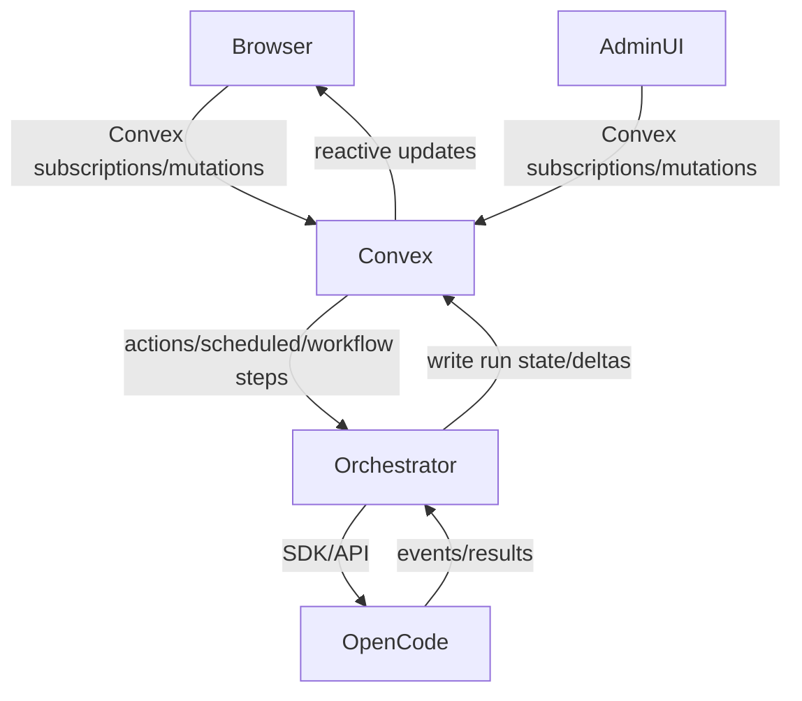

# Convex Evaluation For OpenCode-Orchestrated Bot Architecture

Analyzed repo: `get-convex/convex-backend` at commit `04b8974f91`  
Docs scope analyzed: `npm-packages/docs`  
Analysis date: `2026-02-16`

## Goal and framing

This evaluation is for your specific plan:

- use **OpenCode** as the agent/skill/MCP/ACP execution harness,
- use **Convex** as resilient orchestration/state/realtime backbone,
- build a friendlier UI and add heartbeat/timing/cron/memory capabilities,
- avoid fragile browser-to-agent direct websocket behavior.

## Executive verdict

**Yes, this materially changes the recommendation.**  
For this architecture, Convex is a strong fit.

Most important reason: Convex can become the stable state + realtime transport layer between browser clients and your long-running agent orchestration, while OpenCode remains the runtime doing tool/model work.

## What Convex gives you (relevant to your pain points)

### 1) Realtime state sync with reconnection semantics

- Convex clients are websocket-based and subscription-driven (`docs/client/react.mdx:333`, `docs/understanding/index.mdx:149`).
- If internet drops, client reconnect/session re-establishment is automatic (`docs/client/react.mdx:340`).
- Convex query subscriptions are reactive and updated from consistent snapshots (`docs/realtime.mdx:30`, `docs/understanding/index.mdx:145`).
- Convex provides retry behavior over websocket protocol in TanStack integration (`docs/client/tanstack/tanstack-query/index.mdx:147`).

Implication: better UX than “raw agent websocket pipe to browser” for many failure modes.

### 2) Durable scheduling primitives

- Scheduled functions are stored in DB and resilient across downtime/restarts (`docs/scheduling/scheduled-functions.mdx:13`).
- Scheduling from mutations is atomic with mutation success (`docs/scheduling/scheduled-functions.mdx:50`).
- Built-in cron support includes interval and cron syntax (`docs/scheduling/cron-jobs.mdx:36`).

Implication: you can build heartbeat/timers/maintenance without bolting on separate queue infra initially.

### 3) Memory/search stack for both vector and non-vector use

- Vector search exists, supports filtering, and is up-to-date (`docs/search/vector-search.mdx:21`).
- Full-text search is reactive/consistent/transactional (`docs/search/text-search.mdx:17`).
- “AI & Search” docs explicitly frame RAG + quick search use (`docs/search.mdx:9`).

Implication: Convex can hold operational memory + retrieval state (semantic + lexical) for agent workflows.

### 4) Strong TypeScript ergonomics, including Bun path

- End-to-end type support via generated model/api types (`docs/understanding/best-practices/typescript.mdx:17`, `docs/understanding/best-practices/typescript.mdx:63`).
- Bun support includes subscription client and HTTP client (`docs/client/javascript/bun.mdx:11`).

Implication: your “Bun-first with type safety” goal is realistic.

## Critical constraints (do not ignore)

### 1) Actions are side-effect-capable but not automatically retried

- Actions do not get automatic retries (`docs/client/react.mdx:329`, `docs/functions/actions.mdx:252`).
- For scheduled functions: mutations are exactly-once; actions are at-most-once and may require manual retry patterns (`docs/scheduling/scheduled-functions.mdx:159`, `docs/scheduling/scheduled-functions.mdx:164`).

Architecture consequence: OpenCode-triggering steps should be designed idempotently and wrapped with explicit retry/workflow strategy.

### 2) Cron skip behavior under long execution

- At most one run per cron executes at a time; future runs may be skipped if a prior run is still executing (`docs/scheduling/cron-jobs.mdx:65`).

Architecture consequence: do not use one long-running cron job as a strict heartbeat source; use lightweight cron tick + queued units of work.

### 3) Vector search has execution model limits

- Vector search is action-only (`docs/search/vector-search.mdx:23`, `docs/search/vector-search.mdx:76`).
- Action-returned vector result sets are not inherently reactive (`docs/search/vector-search.mdx:253`).

Architecture consequence: separate “search result generation” from “reactive entity rendering” in UI.

### 4) Action runtime limits matter for heavy agent work

- Actions timeout after 10 minutes (`docs/functions/actions.mdx:239`).

Architecture consequence: split large tasks into resumable steps; do not assume one giant action can run all orchestration.

## Revised assessment for your proposed stack

## Convex + OpenCode is a good pairing if responsibilities are cleanly separated

- **OpenCode owns**: model/tool execution, MCP/ACP/skills, session-level agent behavior.
- **Convex owns**: orchestration state machine, scheduling, retries/workflows, memory/indexes, client-facing realtime state.
- **UI owns**: interaction against Convex subscriptions/mutations (not direct OpenCode websocket dependency).

This separation directly addresses your OpenClaw websocket fragility concern.

## Practical architecture shape

Where:

- `Orchestrator` can be Convex actions + workflow components (or a small external worker polling Convex jobs).
- Browser never depends on a fragile direct channel to the agent runtime.

## Recommendation: Go / No-Go

- **Go** on using Convex as orchestration/state/realtime backbone.
- **Go** on using OpenCode as execution harness.
- **No-Go** on relying only on raw long-running actions without a retry/workflow/idempotency layer.

## Implementation guidance (order)

1. Define Convex data model for runs, steps, heartbeats, outputs, and agent session mapping.
2. Implement “submit task” mutation + durable scheduled/workflow execution path.
3. Wrap OpenCode invocations behind idempotent step functions.
4. Persist incremental outputs/deltas into Convex; drive UI via subscriptions.
5. Add vector + full-text retrieval tables for memory.
6. Add cron-based maintenance (stale run detection, retry enqueue, cleanup) with short-running jobs.

## Bottom line

With your updated intent, Convex is not just “possible”; it is a strong architectural upgrade for resiliency and operability around OpenCode.  
Used this way, it should reduce websocket fragility in the browser significantly by moving realtime UX onto Convex’s subscription model and keeping agent execution behind a durable orchestration layer.
