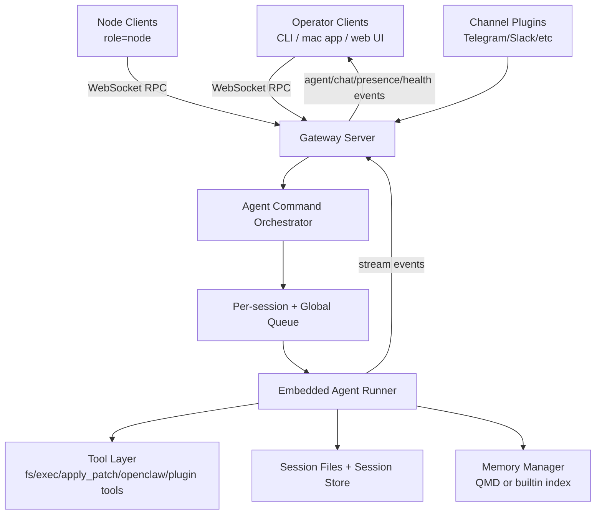
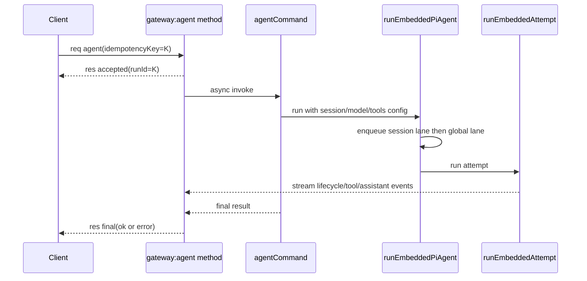
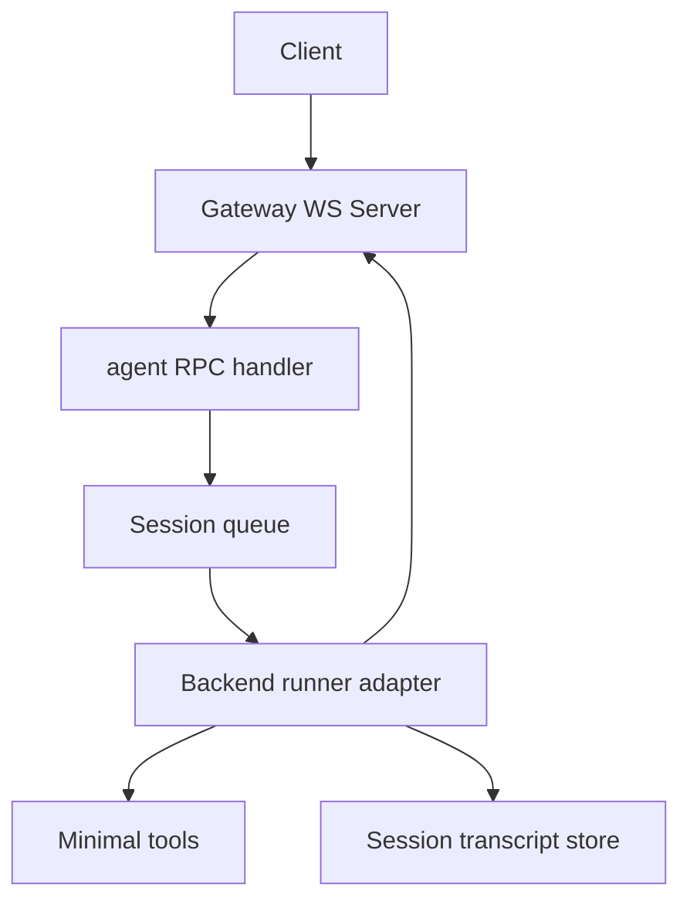

# OpenClaw Architecture Breakdown

Analyzed repo: `openclaw/openclaw` at commit `b3d3f3636`  
Analysis date: `2026-02-16`

## Why this document exists

This is a practical architecture map of OpenClaw focused on:

- how requests move through the system,
- what modules own which responsibilities,
- what complexity is optional vs core,
- how to build a slimmer reimplementation with a different agent backend.

## Executive summary

OpenClaw is a **local-first gateway daemon** plus a **pluggable channel/tool platform** plus an **embedded coding-agent runtime**.

Core shape:

1. A single Gateway process exposes HTTP + WebSocket control APIs.
2. Clients connect over WS and issue RPC methods (`agent`, `send`, `sessions.*`, etc).
3. Agent runs are acked immediately, then executed asynchronously through a queued runtime.
4. The runtime streams lifecycle/tool/assistant events back over WS.
5. Channels, tools, hooks, and providers are plugin-registered rather than hardcoded.

## Top-level architecture

## Startup and boot sequence

## Runtime entry chain

- `openclaw.mjs` loads compiled dist entry.
- `src/entry.ts` normalizes env/argv and imports CLI runner.
- `src/cli/run-main.ts` routes command execution.
- `src/gateway/server.impl.ts` is the real gateway bootstrap path for `openclaw gateway`.

## Gateway startup order (important)

From `src/gateway/server.impl.ts`:

1. Read and validate config snapshot, auto-migrate legacy config, auto-enable plugins.
2. Resolve runtime config (bind/auth/tls/control UI/hook config).
3. Load plugin registry and merge plugin gateway methods.
4. Build HTTP/WS runtime state via `createGatewayRuntimeState`.
5. Create channel manager from loaded channel plugins.
6. Attach WS handlers with full request context.
7. Start maintenance timers, heartbeat runner, cron, discovery, tailscale exposure, sidecars.
8. Start config reloader and install graceful shutdown handlers.

This means gateway runtime is the true integration point of all subsystems.

## Gateway transport and protocol

Primary files:

- `src/gateway/server-runtime-state.ts`
- `src/gateway/server-ws-runtime.ts`
- `src/gateway/server/ws-connection.ts`
- `src/gateway/server/ws-connection/message-handler.ts`
- `src/gateway/server-methods-list.ts`
- `src/gateway/server-methods.ts`

## Wire model

- WS frames are JSON.
- First request frame must be `connect`.
- Normal request/response:
  - request: `{ type:"req", id, method, params }`
  - response: `{ type:"res", id, ok, payload|error }`
- Server events: `{ type:"event", event, payload }`

## Handshake and auth behavior

Handshake logic in `message-handler.ts` does:

1. Validate `connect` shape and protocol compatibility.
2. Resolve role (`operator` or `node`) and declared scopes.
3. Run gateway auth (`token`/`password`/tailscale policy).
4. Validate device identity signature + nonce (strict on non-local clients).
5. Verify or issue device token.
6. Enforce pairing/device permissions (role/scope upgrade requires pairing approval).
7. Send `hello-ok` payload containing methods/events snapshot and policy limits.

`connect.challenge` event is sent immediately after socket open; clients sign its nonce for device auth.

## Method dispatch + RBAC

`src/gateway/server-methods.ts`:

- merges all handler groups (`agent`, `chat`, `sessions`, `nodes`, `config`, etc),
- authorizes by role and scopes before dispatch,
- blocks unknown methods with structured protocol errors.

Scope model is explicit (`operator.read`, `operator.write`, `operator.admin`, etc), with strict defaults.

## Agent execution pipeline

Primary files:

- `src/gateway/server-methods/agent.ts`
- `src/commands/agent.ts`
- `src/agents/pi-embedded-runner/run.ts`
- `src/agents/pi-embedded-runner/run/attempt.ts`
- `src/agents/pi-embedded-subscribe.ts`
- `src/agents/pi-embedded-runner/runs.ts`
- `src/gateway/server-methods/agent-job.ts`

## End-to-end flow

## Key runtime characteristics

- `agent` method returns **accepted ack** immediately, then a final response later.
- Idempotency key drives dedupe cache to avoid duplicate runs.
- `agent.wait` waits on cached lifecycle snapshots from `agent-job.ts`.
- `runEmbeddedPiAgent` uses two queues:
  - session lane (`session:<key>`) for per-session serialization,
  - global lane (`main` or configured) for process-level concurrency caps.
- Runner does model/auth profile failover, thinking-level fallback, timeout abort, overflow compaction retries, and tool-result truncation fallback.

## The embedded attempt stage

`run/attempt.ts` is the heavy implementation:

- resolves workspace/sandbox context and cwd,
- prepares session manager with write lock,
- builds tool set and applies policy,
- builds system prompt from base + skills + bootstrap context + overrides,
- executes model stream, tracks tool calls, streams deltas,
- persists transcript, handles compaction states and retries.

For your rewrite, this file is the single biggest complexity concentration.

## Queueing and concurrency model

Primary files:

- `src/process/command-queue.ts`
- `src/agents/pi-embedded-runner/lanes.ts`
- `docs/concepts/queue.md`

Design:

- lane-aware FIFO in-process queue,
- configurable per-lane max concurrency,
- generation reset support after in-process restart,
- explicit lane clear and active-task drain helpers.

Critical invariant: one active run per session key at a time.

## Tools and tool policy architecture

Primary files:

- `src/agents/pi-tools.ts`
- `src/agents/tool-policy.ts`
- `src/agents/tool-policy-pipeline.ts`
- `src/plugins/tools.ts`

## Tool construction

`createOpenClawCodingTools` composes:

- filesystem tools (`read`, `write`, `edit`, `apply_patch`),
- runtime tools (`exec`, `process`),
- OpenClaw native tools (sessions, message, gateway, browser, nodes, etc),
- plugin-provided tools.

## Policy pipeline

Tool allow/deny is applied as a layered pipeline:

1. profile policy,
2. provider-profile policy,
3. global policy,
4. global-provider policy,
5. agent policy,
6. agent-provider policy,
7. group policy,
8. sandbox/subagent constraints,
9. owner-only restrictions.

This is powerful but one of the highest complexity areas.

## Plugins and channels

Primary files:

- `src/plugins/loader.ts`
- `src/plugins/registry.ts`
- `src/plugins/tools.ts`
- `src/gateway/server-plugins.ts`
- `src/channels/plugins/index.ts`
- `src/gateway/server-channels.ts`
- `extensions/telegram/src/channel.ts` (example plugin)

## Plugin model

Plugins can register:

- gateway methods,
- tools,
- hooks,
- channels,
- providers,
- CLI commands,
- HTTP handlers/routes,
- services.

Loader behavior includes discovery, manifest/schema validation, runtime loading via `jiti`, and conflict diagnostics.

## Channel model

Channels are plugin-defined adapters with account-aware lifecycle:

- `startAccount`/`stopAccount` via channel manager,
- account configuration and status shaping,
- outbound send adapters (text/media/poll/etc),
- security policy hooks (allowlist/pairing behavior).

Gateway itself does not hardcode channel-specific logic; it delegates to channel plugins.

## Sessions, persistence, and routing

Primary files:

- `src/config/sessions/store.ts`
- `src/config/sessions/*.ts`
- `src/routing/session-key.ts`
- `src/routing/resolve-route.ts`
- `src/sessions/transcript-events.ts`

## Session model

- Session keys are agent-scoped (`agent:<agentId>:...`).
- Session store is JSON on disk with TTL cache and maintenance.
- Writes use locking to avoid races.
- Routing resolves agent by deterministic precedence:
  - peer, parent peer, guild+roles, guild, team, account, channel, default.

This routing logic is one of the most reusable pieces if you need multi-agent isolation.

## Config system

Primary files:

- `src/config/io.ts`
- `src/config/paths.ts`

Config layer handles:

- JSON5 parsing,
- include/merge patch resolution,
- env var substitution and restore logic,
- defaults application,
- plugin-aware validation,
- backup rotation and write audit trails.

This is robust but heavier than needed for an MVP.

## Memory subsystem

Primary files:

- `src/memory/search-manager.ts`
- `src/memory/manager.ts`
- `src/agents/tools/memory-tool.ts`

Architecture:

- memory tools call a manager facade,
- manager selects backend (`qmd` preferred if configured),
- wrapper falls back to builtin index manager on backend failures,
- builtin manager supports embeddings + hybrid retrieval and background sync/watch modes.

Memory is optional for an MVP but useful once core chat quality stabilizes.

## What is core vs optional for your custom rewrite

## Keep (core)

- WS gateway with `connect` + request/response/event protocol.
- Strong session identity + per-session queueing.
- Agent RPC semantics (`accepted` then async final).
- Minimal session store persistence.
- Minimal tool layer (`read`, `write`, `exec`, `apply_patch`).
- Clear lifecycle streaming events (`start`, `assistant delta`, `tool`, `end/error`).

## Cut first (optional complexity)

- multi-account channel plugins,
- pairing/device-token and node role complexity,
- plugin loader + runtime dynamic registration,
- fallback auth-profile orchestration,
- advanced compaction/recovery branches,
- tailscale/discovery/cron/voicewake/browser control sidecars,
- memory subsystem,
- huge config include/env/audit machinery.

## Suggested slim architecture for your version

## Replaceable abstraction: backend runner adapter

Define one boundary:

- Input: `{sessionKey, prompt, tools, config, abortSignal}`
- Output: stream callbacks + final `{messages, usage, error?}`

Then implement adapter for your preferred agent basis (instead of Pi runtime).  
Everything else (gateway, queue, sessions, tool policy-lite) can stay mostly backend-agnostic.

## Proposed phased implementation plan

## Phase 1: Protocol + queue + transcript

- Implement `connect`, `agent`, `agent.wait`.
- Build session-key model and per-session lane queue.
- Persist minimal transcript and run snapshots.

## Phase 2: Backend adapter + streaming

- Implement runner adapter interface.
- Stream lifecycle + assistant deltas.
- Add timeout + abort support.

## Phase 3: Minimal tools + policy-lite

- Add `read`/`write`/`exec`/`apply_patch`.
- Add very simple allowlist policy.
- Add deterministic error shaping.

## Phase 4: Routing + multi-agent (if needed)

- Add binding-based agent selection only if you actually need multi-agent.
- Keep precedence deterministic as in `resolve-route.ts`.

## Phase 5: Optional features

- Add plugins/channels one by one only when required.
- Add memory only after core assistant loop is stable.

## Practical guidance for building your own version with me

If we start implementation together, the safest order is:

1. Freeze a tiny protocol first.
2. Build queue + transcript correctness tests.
3. Integrate your chosen agent backend behind adapter boundary.
4. Add tools last, with strict policy defaults.

That gives you OpenClaw's strongest ideas (session correctness, streamable async runs, tooling) without inheriting all of its ecosystem complexity.

