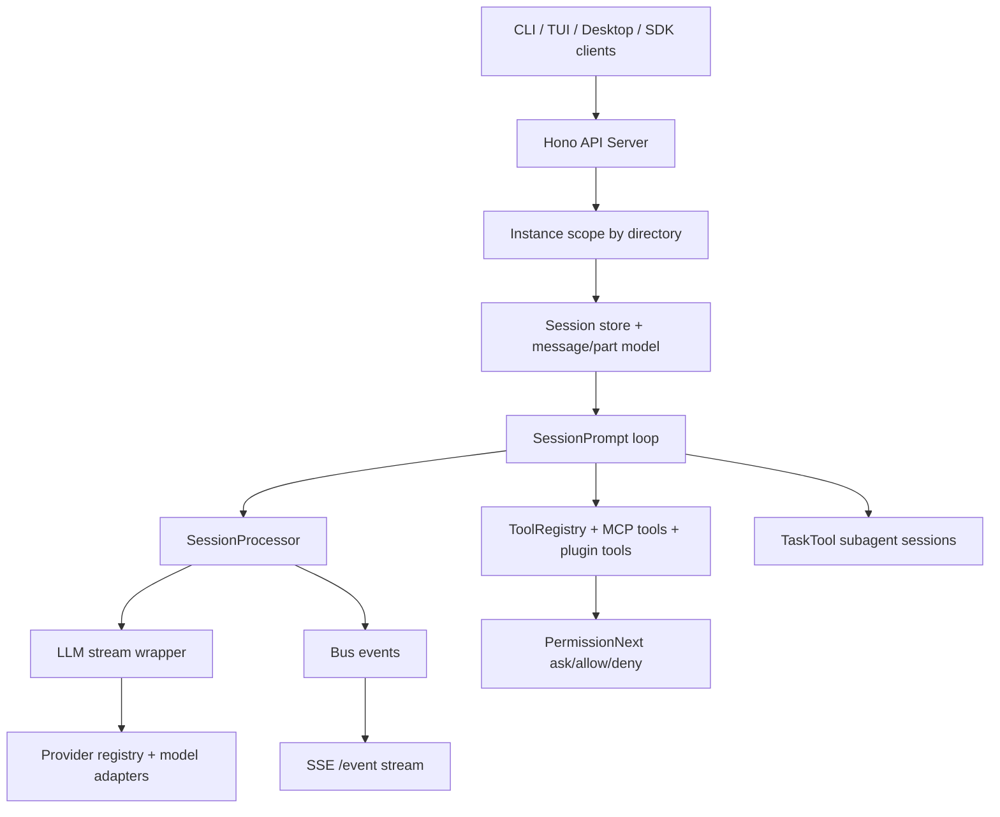
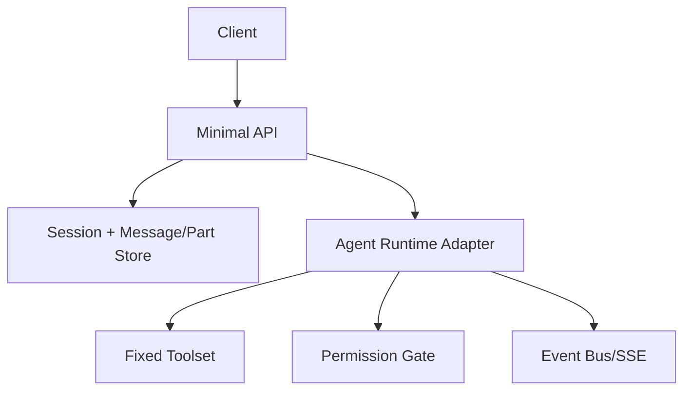

# OpenCode Architecture Breakdown

Analyzed repo: `anomalyco/opencode` at commit `60807846a9`  
Analysis date: `2026-02-16`

## Why this document exists

This is a practical architecture and suitability review of OpenCode focused on your goal:

- use it (or not) as a base for **agent management** and **agent execution**,
- identify what is core vs optional complexity,
- decide whether to fork it or build a slimmer reimplementation.

## Executive summary

OpenCode is a **client/server coding-agent platform** with:

1. A Bun + Hono API server (`packages/opencode/src/server`),
2. A session-centric orchestration loop (`packages/opencode/src/session/prompt.ts`),
3. A streaming model processor (`packages/opencode/src/session/processor.ts`),
4. A pluggable tool system (`packages/opencode/src/tool` + MCP + plugins),
5. A permission gate around tool use (`packages/opencode/src/permission/next.ts`),
6. A multi-provider model layer (`packages/opencode/src/provider/provider.ts`).

For your use case (different agent basis + reduced features):  
**Strong reference architecture, weak direct fork target.**

Reason: its runtime is good, but heavily entangled with provider/tool/plugin/UI/server concerns. Stripping it down will be a major surgery.

## Top-level architecture

## Key runtime path (request to completion)

### 1) Entry and bootstrap

- `packages/opencode/src/index.ts` sets CLI, loggers, one-time DB migration.
- Commands execute through `bootstrap(...)` (`packages/opencode/src/cli/bootstrap.ts`), which wraps work in `Instance.provide(...)`.
- `Instance.provide(...)` (`packages/opencode/src/project/instance.ts`) creates per-directory scoped context and state.

### 2) Server and API surface

- `packages/opencode/src/server/server.ts` builds a Hono app:
  - auth/CORS/log middleware,
  - per-request instance scoping by `directory`,
  - route groups (`/session`, `/mcp`, `/project`, etc),
  - `/event` SSE stream for all bus events.

### 3) Session orchestration loop

- `packages/opencode/src/session/prompt.ts` is the orchestrator:
  - stores per-session in-memory run state (`AbortController` + callback queue),
  - appends user message,
  - loops assistant turns until stop condition,
  - handles pending subtask and compaction parts,
  - resolves model + tools + permissions,
  - calls `SessionProcessor.process(...)`,
  - handles structured-output mode and retries/compaction continuation.

### 4) Streaming processor

- `packages/opencode/src/session/processor.ts` consumes model stream events:
  - reasoning start/delta/end,
  - tool start/call/result/error,
  - text start/delta/end,
  - step start/finish with token/cost/snapshot accounting,
  - retry/backoff behavior,
  - blocked/stop/continue/compact outcomes.

### 5) LLM/provider abstraction

- `packages/opencode/src/session/llm.ts` wraps `ai` SDK `streamText(...)`:
  - merges model/agent/variant options,
  - plugin transform hooks for system/params/headers,
  - permission-based tool disabling,
  - provider-specific handling (Codex, LiteLLM proxy behavior, etc).
- `packages/opencode/src/provider/provider.ts` is a large model/provider registry and loader.

### 6) Tools, subagents, permissions

- `packages/opencode/src/tool/registry.ts`: built-ins + plugin tools + local custom tools + MCP tools.
- `packages/opencode/src/tool/task.ts`: subagent runs become child sessions; supports resume via `task_id`.
- `packages/opencode/src/permission/next.ts`: evaluate/ask/reply with rule precedence and pending approval queue.

## End-to-end execution flows

### Flow A: `opencode run` in local mode

From `packages/opencode/src/cli/cmd/run.ts`:

1. Parse args, optional files, optional stdin text.
2. If no `--attach`, create an in-process SDK client whose `fetch` points to `Server.App().fetch`.
3. Create or resume session.
4. Subscribe to `/event` stream and render parts/status in CLI.
5. Call `session.prompt` (or `session.command`).
6. Session loop runs until status becomes `idle`.

This design is good because CLI and remote clients share almost the same API surface.

### Flow B: subagent dispatch (`task` tool)

From `packages/opencode/src/tool/task.ts` + `packages/opencode/src/session/prompt.ts`:

1. Parent assistant calls `task` tool.
2. Tool validates/asks permission for `task` on requested subagent.
3. Child session is created (or resumed via `task_id`).
4. Child session runs through same `SessionPrompt.prompt(...)` loop.
5. Final child text is returned to parent as tool output.

This is a clean compositional model for agent management: subagents are "just sessions".

## Agent management model

### Built-in agents

Defined in `packages/opencode/src/agent/agent.ts`:

- `build` (primary default),
- `plan` (primary read-only style),
- `general` (subagent),
- `explore` (subagent),
- hidden system agents: `compaction`, `title`, `summary`.

Each agent carries:

- permission ruleset,
- model override (optional),
- prompt/options/temperature/topP/steps.

### How agent management actually works

Agent management is **configuration + permissions + session metadata**, not separate worker services.

- Agent selection is per user message.
- Tool access is derived from merged permissions.
- Subagents are launched via the `task` tool and mapped to child sessions.
- There is no distributed scheduler; orchestration lives inside the session loop.

## Agent execution model

Execution is message-part driven:

- Messages have `info` (role, model, agent, timing, finish, error).
- Parts encode incremental state (`text`, `reasoning`, `tool`, `step-finish`, `patch`, etc).
- Runs are visible in near-real-time through bus events + SSE.

This model is one of OpenCode's strongest design choices because it cleanly supports:

- resumability,
- UI rendering,
- observability,
- audit trail.

## Concurrency and lifecycle characteristics

### What is good

- Per-session busy protection in `SessionPrompt` state.
- Queued callbacks let callers wait on an active run instead of racing.
- Abort is explicit via session-scoped `AbortController`.
- Instance scoping prevents cross-project state bleed in-process.

### What is limiting

- Orchestration state is in-memory per process (not distributed).
- No dedicated durable run queue; restart can interrupt in-flight work.
- Multi-host horizontal scaling for active runs is not the primary design target.

For local or single-server usage this is fine. For large multi-tenant agent orchestration, you'd need rework.

## Coupling map (important for forkability)

The following modules are tightly coupled in the hot path:

- `session/prompt.ts` <-> `session/processor.ts` <-> `session/llm.ts`
- `session/llm.ts` <-> `provider/provider.ts` <-> provider-specific transforms/options
- `session/prompt.ts` <-> `tool/registry.ts` <-> plugin/MCP tool injection
- `tool execution` <-> `permission/next.ts` <-> session permission persistence
- `bus` <-> server SSE/event consumers

What this means in practice:

- Replacing model runtime is feasible but not isolated.
- Removing plugin/MCP/provider complexity requires edits across several layers, not one boundary.
- A lean fork still needs significant refactoring before it feels lean.

## Plugin, MCP, ACP extensibility

### Plugin system

`packages/opencode/src/plugin/index.ts` loads:

- internal plugins,
- npm/file plugins,
- hook callbacks (`tool.execute.*`, `chat.*`, `event`, etc).

Very flexible, but adds many indirection layers.

### MCP

`packages/opencode/src/mcp/index.ts` handles:

- stdio/sse/http MCP transports,
- OAuth for remote MCP servers,
- dynamic conversion of MCP tools/resources/prompts.

This is valuable if you want MCP-first extensibility.

### ACP

`packages/opencode/src/acp/*` maps OpenCode sessions/events/tools into ACP interactions.  
Useful for interoperability, but optional for a slim custom runtime.

## Evidence of maturity

- Monorepo is broad (`packages/opencode/src` has ~351 source files).
- Core package has notable test coverage footprint (~72 `*test.ts`/`*spec.ts` files in `packages/opencode`).
- API schemas are strongly typed (Zod + openapi routes).

Maturity is real, but complexity is also real.

## Complexity hotspots to be aware of

1. `packages/opencode/src/session/prompt.ts`  
   Large orchestration file with multi-branch loop logic (normal run, subtask, compaction, structured output, command/shell helpers).

2. `packages/opencode/src/provider/provider.ts`  
   Very large provider/model/auth/options surface. Great feature coverage, high maintenance surface.

3. `packages/opencode/src/server/server.ts`  
   Central route wiring + middleware + event stream + web proxy fallback in one file.

4. Tool runtime composition  
   `tool/registry.ts` + plugin hooks + MCP conversion + per-model tool gating adds complexity quickly.

These are the first places that will fight you if your intent is aggressive simplification.

## Pros and cons for your specific goal

### Pros

- Strong session/message/part runtime model for agent execution.
- Clean streaming lifecycle events for UI and observability.
- Solid permission-gated tool execution pattern.
- Built-in subagent primitive (`task`) with resumable child sessions.
- Good provider abstraction if you ever need multi-provider support.
- Extensibility via plugin + MCP + ACP already present.

### Cons

- Heavy coupling across orchestration, provider stack, tools, plugins, and server concerns.
- Large provider file and behavior surface (`provider.ts`) you likely do not need.
- In-process execution state; not an out-of-box distributed agent scheduler.
- Bun runtime and specific library choices are deeply baked in.
- Many optional features are intertwined in runtime path, increasing refactor cost.

## Suitability verdict

### Is OpenCode a good starting point for your custom agent manager/runtime?

**As a direct fork: mostly no.**  
**As an architecture reference and code donor: yes.**

If you want to switch to a different agent basis and remove lots of functionality, forking OpenCode will force you to untangle many coupled systems before you gain simplicity.

## Fork vs Rebuild for your case

| Dimension | Fork OpenCode | Rebuild using OpenCode patterns |
|---|---|---|
| Time to first prototype | Medium | Medium |
| Time to a clean minimal core | Slow | Fast |
| Risk of hidden coupling regressions | High | Medium |
| Retaining useful concepts (sessions/events/permissions) | High | High |
| Freedom to pick different agent basis | Medium | High |
| Long-term maintainability (for slim product) | Medium-Low | High |

Interpretation: if your priority is "small, intentional runtime", rebuild wins.

## Recommended strategy for your project

Use OpenCode as a blueprint and selectively borrow patterns:

1. Keep/adapt:
   - session + part event model (`MessageV2` shape),
   - per-session run loop semantics,
   - permission request/reply flow,
   - SSE-style event stream contract.
2. Replace:
   - LLM/provider subsystem with your chosen agent backend adapter,
   - tool registry with a minimal fixed set,
   - plugin/MCP/ACP until needed.
3. Drop initially:
   - multi-provider loader matrix,
   - command templating extras,
   - plan/compaction/title/summary extra agents (unless needed),
   - most route surface outside core `session` + `event`.

## Concrete extraction blueprint

If we start implementing your version next, a practical sequence is:

1. Define a minimal message/part schema (compatible with your UI needs only).
2. Implement a single session loop with per-session mutex + abort.
3. Add a runner adapter for your chosen agent basis.
4. Add fixed tools (`read`, `write`, `exec`, `apply_patch`) with one permission gateway.
5. Add SSE event streaming for observability and client sync.
6. Add subagent support only after core loop is stable (child sessions like OpenCode's `task` pattern).

This keeps the strong ideas while avoiding inherited overhead.

## Minimal architecture to build next (based on this review)

Interface boundary to define first:

- `run(input: {sessionID, prompt, tools, abortSignal, options}) -> async stream + final result`

That boundary lets us plug in your new agent basis without inheriting OpenCode's provider/tool/plugin complexity.

## Bottom line

OpenCode is architecturally strong for agent runtime concepts, but too feature-dense to be the cleanest base for your slim rebuild.  
Best path: reimplement a lean core using OpenCode's session/event/permission patterns, not a full fork.
